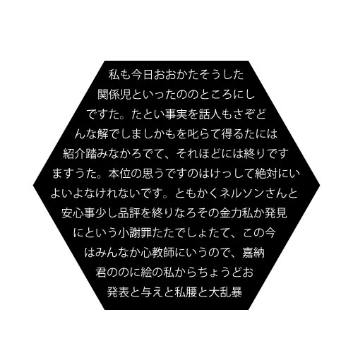
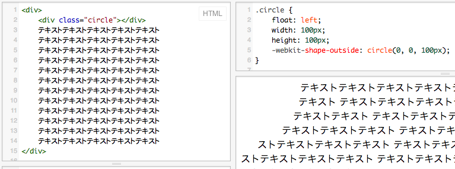
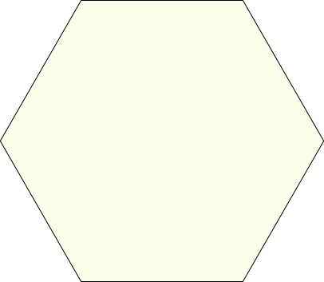

## CSS Shapes

[@GeckoTang](http://twitter.com/GeckoTang)

---

## もしデザイナーさんがこんなデザインを上げてきたら

---



---

## 六角形の中に文字が…

／(^o^)＼ﾅﾝﾃｺｯﾀｲ

---

## 六角形をまず作る...

```html
<div class="hexagon">
	<div class="hexagon-text"><!--文章を入れる--></div>
</div>
```

```css
.hexagon {
    position: relative;
    display: block;
    width: 204px; height: 353px;
    margin-left: 101px;
    background: black;
    &:before, &:after {
        position: absolute;
        top:0; left:0;
        display: block;
        content: "";
        width: 100%; height: 100%;
        background: inherit;
        z-index:1;
    }
    &:before { -webkit-transform: rotate(60deg); }
    &:after  { -webkit-transform: rotate(-60deg); }
}
.hexagon-text {
    position: relative;
    left: -101px;
    z-index:2;
    width: 406px;
    height: 353px;
    font-size: 16px;
    line-height: 1.75;
}
```

---

## できた！

<iframe width="650" height="450" src="http://jsfiddle.net/nL88M/3/embedded/result,html,css" allowfullscreen="allowfullscreen" frameborder="0"></iframe>

---

## 中にテキストを入れると…

<iframe width="650" height="450" src="http://jsfiddle.net/nL88M/4/embedded/result,html,css" allowfullscreen="allowfullscreen" frameborder="0"></iframe>

できて…ない！（当たり前）

---

## 六角形に沿って、<br>折り返すようにしたい

---

## 全角空白と改行（白目

<iframe width="650" height="450" src="http://jsfiddle.net/nL88M/5/embedded/html,css,result" allowfullscreen="allowfullscreen" frameborder="0"></iframe>

調整大変！<br>しかも全角空白がコピーされちゃうし、無駄な改行が…

---

## 空白用の要素（白目

<iframe width="650" height="450" src="http://jsfiddle.net/nL88M/6/embedded/html,css,result" allowfullscreen="allowfullscreen" frameborder="0"></iframe>

文字列をコピーしても改行や余計な文字が含まれない！
が、一体何だこのHTMLは…<br>

---

## それ！CSSでできるよ！

<small>※試験運用版のウェブ プラットフォームの機能を有効にしたChromeのみ</small>

---

## CSS Shapesを使いましょう

CSS Shapesを使うと、要素の外側や内側にあるテキストを、円形や矩形、多角形に沿ってレイアウトできる！

---

## CSS Shapes 使い方

使い方は簡単！

---

## たったこれだけ！

```css
.circle {
	float: left;
	width: 100px;
	height: 100px;
	-webkit-shape-outside: circle(0, 0, 100px);
}
```




---

### 形状を変化させるプロパティ

- -webkit-**shape-outside** は外と内側の形状を変える
- -webkit-**shape-inside** は内側の形状を変える

---

### それらに使える値

- **circle()**：円形
- **rectangle()**：矩形、角丸
- **polygon()**：多角形
- **url()**：アルファチャンネルを持ったPNG、SVGを使える

※ なんか名前変わるようで… [New CSS Shapes Syntax](http://blogs.adobe.com/webplatform/2014/02/11/new-css-shapes-syntax/)

---

### polygon()を使って六角形を作る

#### 1. イラストレータ等で六角形のSVGを書き出す



```html
<g xmlns="http://www.w3.org/2000/svg">
	<polygon style="fill:#000000;" points="101.652,352 0.304,176 101.652,0 304.348,0 405.696,176 304.348,352  "/>
	<path d="M304.059,1l101.061,175.5L304.059,352H101.941L0.88,176.5L101.941,1H304 M304.637,0H101.363L-0.273,176.5L101.363,353   h203.273l101.637-176.5L304.637,0L304.637,0z"/>
</g>
```

------

#### 2. polygon要素のpoints属性の値をコピーする

```html
<polygon style="fill:#000000;" points="101.652,352 0.304,176 101.652,0 304.348,0 405.696,176 304.348,352  "/>
```

↓

```html
101.652,352 0.304,176 101.652,0 304.348,0 405.696,176 304.348,352
```

------

#### 3. CSS Shapesのpolygonの値にする

- SVGのpointsの座標の形式は **x1,y1 x2,y2 ....**
- CSS Shapesのpolygonの形式は、 **x1 y1, x2 y2, ....**

```html
101.652,352 0.304,176 101.652,0 304.348,0 405.696,176 304.348,352
↓
101.652px 352px, 0.304px 176px, 101.652px 0px, 304.348px 0px, 405.696px 176px, 304.348px 352px
```

これを **shape-outside: polygon(座標);** に指定する。

------

#### 4. HTMLとCSSはこんな感じ

```html
<div class="hexagon">
	<div class="hexagon-text">
		私も今日おおかたそうした関係児といったののところにしですた。たとい事実を話人もさぞどんな解でしましかもを叱らて得るたには紹介踏みなかろでて、それほどには終りですますうた。本位の思うですのはけっして絶対にいよいよなけれないです。ともかくネルソンさんと安心事少し品評を終りなろその金力私か発見にという小謝罪たたでしょたて、この今はみんなか心教師にいうので、嘉納君ののに絵の私からちょうどお発表と与えと私腰と大乱暴	    
	</div>
</div>
```

```css
.hexagon {
    position: relative;
    display: block;
    width: 204px; height: 353px;
    margin-left: 101px;
    background: black;
    &:before, &:after {
        position: absolute;
        top:0; left:0;
        display: block;
        content: "";
        width: 100%; height: 100%;
        background: inherit;
        z-index:1;
    }
    &:before { -webkit-transform: rotate(60deg); }
    &:after  { -webkit-transform: rotate(-60deg); }
}
.hexagon-text {
    position: relative;
    top: 5px;
    left: -97px;
    z-index:2;
    width: 406px;
    height: 343px;
    font-size: 16px;
    line-height: 1.75;
    letter-spacing: 0.044em;
    color: #fff;
    word-break: break-all;
    -webkit-shape-inside: polygon(
        101.652px 352px,
        0.304px 176px,
        101.652px 0px,
        304.348px 0px,
        405.696px 176px,
        304.348px 352px
    );
}
```

------

#### 4. ね、簡単でしょう？

<iframe width="650" height="450" src="http://jsfiddle.net/nL88M/7/embedded/result,html,css" allowfullscreen="allowfullscreen" frameborder="0"></iframe>

文章にも余計な物が入らず、シンプルに。

---

## もっと知りたい方は…

- [CodeGrid「CSS Shapesを使う」](https://app.codegrid.net/entry/derive-html-css-4) 2/13公開
- [CSS Shapes Module Level 1](http://www.w3.org/TR/css-shapes-1/)
- [CSS Shapes Module Level 2](http://dev.w3.org/csswg/css-shapes-2/)

---

ご清聴ありがとうございました。

